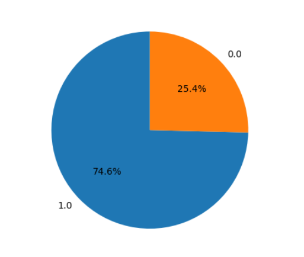
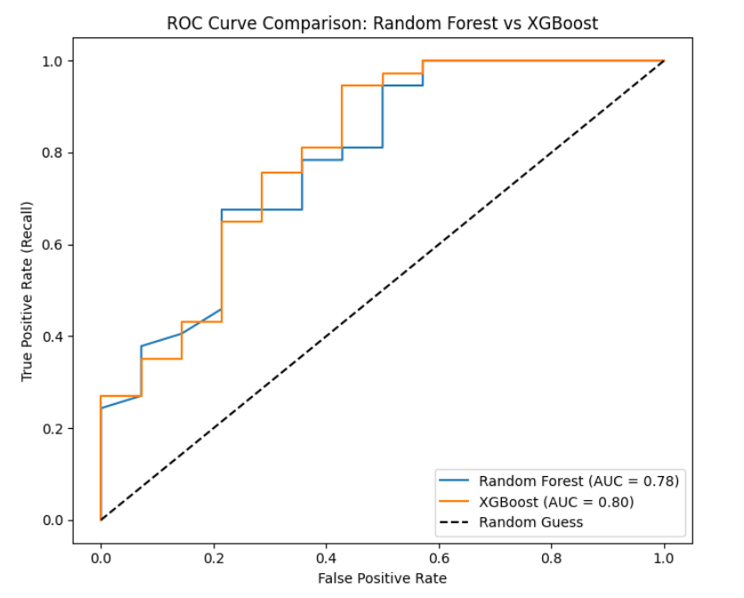

# Parkinson’s Disease Classification (ML)

## Overview
Built and evaluated machine learning models to classify Parkinson’s disease using a high-dimensional dataset.

## Key Results
- Random Forest: Recall (Class 1) = 0.97, Accuracy = 0.82  
- XGBoost: ROC–AUC = 0.80 (Validation)

## Methods
- Preprocessing: scaling, duplicate removal
- Feature Selection: SelectKBest (chi-square)
- Imbalance Handling: Random Oversampling / SMOTE
- Models: Logistic Regression, SVM, Random Forest, XGBoost
- Evaluation: Confusion matrix, ROC curve, ROC–AUC, precision/recall/F1

## Tech Stack
Python, pandas, NumPy, scikit-learn, imbalanced-learn, matplotlib, xgboost

##Visualizations

### Class Distribution

##Model Evaluation

### Random Forest Confusion Matrix

## ROC Curve (Random Forest vs XGBoost)

📘 Project Reference & Acknowledgement

This project is a simulation and independent implementation inspired by a tutorial published on GeeksforGeeks titled "Parkinson Disease Prediction using Machine Learning - Python."

The project was executed step-by-step to strengthen the practical understanding of healthcare data preprocessing, exploratory analysis, class balancing, and predictive modeling.

All code was executed, interpreted, and further evaluated independently for improvements, learning, and portfolio demonstration purposes.

Reference: https://www.geeksforgeeks.org/machine-learning/parkinson-disease-prediction-using-machine-learning-python/

👩‍⚕️ Author:

Pooja Manikonda

MS Health Informatics

